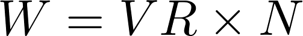
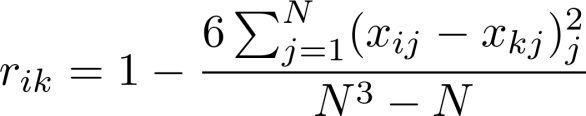
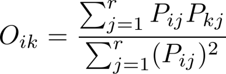
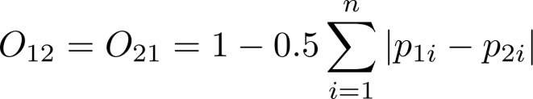

```{r setup, include = FALSE}
knitr::opts_chunk$set(
  collapse = TRUE,
  comment = "#>"
)
```


This tutorial is based on a post (in Chinese) available at: <http://blog.sciencenet.cn/blog-255662-1239853.html>

Ecological niche refers to resource allocation (Jintun Zhang, 2004), and is important in many aspects, for example, ordination analysis, community assembly etc. At the community scale, niche is usually quantified by the occurrence and co-occurrence of species. Although a great number of studies have focused on this topic in the past three decades ((in particular in the Chinese literature, e.g., C. W. Sun and S. D. Zhao, 1996; C. H. Guo et al. 1997; Z. M. Shi et al. 2001; J. L. Li and J. T. Zhang, 2010; N. J. Wang et al. 2010), a computer programme for conducting the relevant analysis is lacking. Here we describe spaa, which stands for SPecies Association Analysis, an R package for conducting suche analysis.

# 1. The installation

spaa is an open source package written in R, available on CRAN.

To install, enter the command `install.packages("spaa")` in the R console, R will ask you to select a CRAN mirror, and the package will be automatically downloaded and installed.

The developing version is available at `https://github.com/helixcn/spaa`, to install it, type:

```r
library(devtools)
install_github("helixcn/spaa")
```

# 2. Functions and datasets in spaa

## 2.1 Main Functions

-   `data2mat`: convert field records into a species-site matrix
-   `freq.calc`: calculate the relative abundance
-   `niche.overlap`: calculate the niche overlap between all the species pairs
-   `niche.overlap.boot`: bootstrap the confidence intervals for niche overlap
-   `niche.overlap.boot.pair`: bootstrap the confidence intervals of niche overlap for each pair of species
-   `niche.overlap.pair`: calculate the niche overlap for each pair of species
-   `niche.width`: calculate niche width
-   `plotlowertri`: visualize distance/similarity matrices
-   `plotnetwork`: visualize network correlation
-   `sp.assoc`: calculate the overall species association
-   `sp.pair`: calculate the association between each pair of species
-   `sub.sp.matrix`: subsetting the community matrix based on relative frequencies

## 2.2 Embedded datasets

-   `splist`: An example dataframe of species, genus, family
-   `datasample`: An example community matrix (wide format)
-   `testdata`: An example community dataset (long format)

# 3. Calculating niche width

## 3.1 Converting community data into a matrix

Community data generally needs to be converted to a matrix (Table 1) when calculating diversity indices, species association, niche width, niche overlap, in which each row represents a plot (site, region or track), each column represents a species, and the number indicates the number of individuals.

Table 1 Community species matrix

|       | sp1 | sp2 | sp3 | sp4 | sp5 | sp6 | sp7 |
|-------|-----|-----|-----|-----|-----|-----|-----|
| plot1 | 3   | 6   | 1   | 2   | 1   | 0   | 0   |
| plot2 | 8   | 0   | 30  | 0   | 0   | 0   | 0   |
| plot3 | 0   | 1   | 0   | 2   | 0   | 1   | 3   |

However, field data are generally recorded in two ways:

1.  Individual-based Field Record Sheet
2.  Plot-based Record Sheet

### 3.1.2 Individual-based Field Record Sheet

Individual-based Field Record Sheet is often used in forest plots census, in which every tree (usually when DBH \>= 1cm) is tagged. Usually, for a woody species, both the main trunk and branches are recorded. The following columns are often included:

1.  plot: indicates the name of the plot (20mX20m) the tree is located at. The first two digits "01" refers to the first 20mX20m from the origin (west to east), the second "01" refers to the first 20mX20m from the origin along the Y axist (south to north)
2.  tag number: the number on the main trunk
3.  species name: the species name of the individual
4.  x-coordinate: the x coordinate of the individual (usually in a local Cartesian System, the unit is often meters easting from the origin)
5.  y-coordinate: the y coordinate of the individual (usually in a local Cartesian System, the unit is often meters northing from the origin)
6.  branch (0 refers to the main trunk, 1 is the second largest branch, 2 is the third largest branch and so on)
7.  diameter at breast height (DBH, usually in cm)
8.  height (usually in meters)
9.  status (alive, dead but standing, collapsed, etc.)
10. remark, any thing to markdown

Table 1. Field record sheet

| plot | tag        | species | x   | y    | branch | dbh | height | status | remark |
|------|------------|---------|-----|------|--------|-----|--------|--------|--------|
| 0101 | btm0101001 | sp1     | 1.5 | 5.8  | 0      | 15  | 12     | alive  | tree   |
| 0101 | btm0101002 | sp2     | 3.3 | 12.1 | 0      | 12  | 10     | alive  | tree   |

... ...

Generating an example community matrix

```{R}
plot <- c("0101", "0101", "0102")
tag <- c("btm0101001", "btm0101002", "btm0101003" )
species <- c("sp1", "sp2", "sp1")
x <- c(1.5, 3.3, 4.1)
y <- c(5.8, 12.1, 8.9)
branch <- c(0, 0, 0)
dbh  <- c(15, 12, 5)
height   <- c(12, 10, 8)
status  <- c("alive", "alive", "alive")
remark  <- c("", "", "")

btmdata <- data.frame(plot, tag, species, x, y, branch, dbh, height, status, remark)

btmdata

# generate a dataset
btm <- table(btmdata$plot, btmdata$species)
btm
```

### 3.1.2 Plot-based Record Sheet

Plot-based Record is much simpler, generally the first column is the name of plot, the second column is species, and the third column is the number of individuals of the species in the sample. Note the value is usually an integer, but could also be a decimal number when representing importance value (Kent M, 2011, page 175).

Table 2 Sample survey form

| plot  | species | abundance |
|-------|---------|-----------|
| plot1 | sp1     | 3         |
| plot1 | sp2     | 6         |
| plot1 | sp3     | 1         |
| plot1 | sp4     | 2         |
| plot1 | sp5     | 1         |
| plot2 | sp1     | 8         |
| plot2 | sp3     | 30        |
| plot3 | sp4     | 2         |
| plot3 | sp2     | 1         |
| plot3 | sp6     | 1         |
| plot3 | sp7     | 3         |

The following code converts sample data to a community-species matrix.

```{R}
library(reshape2)
library(spaa)
data(datasample)

datasample2 <- cbind(plot = row.names(datasample), datasample)

# Convert the modified matrix to the common format of data records
aaa <- melt(data = datasample2,
            id.vars = "plot",
            measure.vars = 2:ncol(datasample2),
            variable.name = "species",
            value.name = "abundance",
            factorsAsStrings = TRUE)

# is 0.00 because the species did not occur in some samples
aaa1 <- aaa[aaa$abundance > 0, ]
head(aaa1)

bbb <- acast(aaa1, 
             formula = plot ~ species, 
             value.var = "abundance", 
             fill = 0)
bbb
```

When the abundance column only contains integers, it can be converted using `data2mat()`. Note that the names of the columns should be named `"plotname", "species", "abundance"` (note R is case sensitive).

```{R}
library(spaa)
data(testdata)
testdata
data2mat(testdata)
```

## 3.2 Calculating species associations

Interspecific associations, including association among all the species and specific association between each pair of species could be computed using spaa (Zhou Xianye et al. 2000; Shi Zuomin et al. 2001; Zhang Siyu and Zheng Shiqun 2002; Zhang Zhiyong et al. 2003; Kang Bing et al. 2005; Wang Wenjin et al. 2007; Wang Naijiang et al. 2010).

### 3.2.1 Species association of the community as a whole

The function `sp.assoc()` computes the following indices and the output is a list with the following elements.

-   `pi`: Species frequency
-   `N`: Number of plots
-   `S`: Number of species
-   `Tj`: Total number of species for each plot
-   `Numspmean`: Mean number of species
-   `sigmaTsq`: Variance of species relative frequency
-   `STsq`: Variance of species number
-   `var.ratio`: Variance ratio
-   `W`: W statiscit: used in comparison with the Chi Square.

An example:

```{R}
data(testdata)
spmatrix <- data2mat(testdata)
sp.assoc(spmatrix)
```

#### 1. Variance of species relative frequency (Equation 1) `sigmaTsq`:

{width="241"}

#### 2. Variance of the number of species (Equation 2) `STsq`

{width="253"}

#### 3. Species' relative frequency (Equation 3) `pi`

{width="180"}

#### 4. Variance ratio (Equation 4) `var.ratio`

{width="198"}

-   If *VR* \> 1, positive correlation
-   if *VR* \< 1, negative correlation

#### 5. The *W* statistic (Equation 5)

The *W* statistic is used to test the significance of the variance ratio (Qianmei Zhang et al., 2006) with 95% confidence intervals of Chi 0.95,N2 \< *W* \< Chi 0.05, N2

{width="293"}

In Equations 1-5, *N* is the number of plots, *S* is the total number of species, *n* is the number of plots occupied by a species, *T_j* is the number of species in each plot, and *t* is the average of the number of species in all plots.

### 3.2.2 Significance test of inters-pecific associations

The association between each pair of species could be calculated using the following code:

```{R}
data(testdata)
spmatrix <- data2mat(testdata)
result <- sp.pair(spmatrix)
```

In this test, a 2X2 contingent table is usually used. If there are species X and species Y occurring in the plots, *a*, *b*, *c*, *d* denote co-occurrence and non-occurrence between them, respectively (Kent M., 2012, page 114):

-   `a`: Number of plots where both species X and Y are present;
-   `b`: Number of plots where X is present but not Y ;
-   `c`: Number of plots where Y is present but not X;
-   `d`: Number of plots where neither X nor Y is present.
-   `n`: Total number of plot `n = a+b+c+d`

The Yates-corrected Chi-square is used when determining whether there is a significant association for small samples (Kent M., 2012, page 114).

The output is a list containing the following elements:

-   `chisq`: chi square matrix
-   `chisqass`: chi square matrix information
-   `V`: Value indicating species association is positive or negative
-   `Ochiai`: Ochiai's index
-   `Dice`: Dice's index
-   `Jaccard`: Jaccard's index
-   `Pearson`: Pearson's correlation
-   `Spearman`: Spearman's rank correlation
-   `PCC`: Point correlation coefficient
-   `AC`: Association coefficient

The equations are shown below:

#### 1. Yates-corrected chi-square test for significance (Equation 6), see `chisq` and `chisqass`

Note: - `chisqass` is the Chi-square - `chisq` is the Chi-square with Yates' correction for small samples (Kent M., 2012, page 114)

{width="533"}

#### 2. V ratio (Equation 7) `V`

{width="344"}

Indicating whether the species association is positive (\>0) or negative (\<0)

#### 3. Jaccard's index (Equation 8) `Jaccard`:

{width="326"}

#### 4. Ochiai index (Equation 9) `Ochiai`:

{width="341"}

#### 5. Dice Index (Equation 10) `Dice`:

{width="270"}

#### 6. *PCC*: Point Correlation Coefficient `PCC` (Equation 11)

{width="527"}

#### 7. *AC* Association coefficient (Equation 12) `AC`

-   If `a*d >= b*c`:

{width="308"}

-   If `b*c > a*d`, and `d >= a`, then (Equation 13):

{width="309"}

-   If `b*c > a*d` and `d < a`, then (Equation 14):

{width="308"}

#### 8. Spearman's rank correlation coefficient `Spearman` (Equation 15)

{width="505"}

#### 9. Pearson's correlation coefficient `Pearson` (Equation 16)

{width="518"}

## 3.3 Calculating niche width

Niche width is commonly measured by the Levins or Shannon indices.

### 1. Levins niche width index (Equation 17)

{width="183"}

### 2. Shannon's niche width index (Equation 18)

{width="193"}

where *B_i* is the niche width of the *i*th species, *j* denotes jth plot, and *r* denotes the number of plots.

The function `niche.width()` can calculate the niche width of each species. The arguments are: `niche.width(mat, method = c("shannon", "levins"))`, where `mat` is the sample-species matrix and `method` is eighther `"shannon"` or `"levins"`.

## 3.4 Niche overlap

`niche.overlap()` calculates the niche overlap coefficients between all species pairs, including: `"levins"` (Note this is different from niche width), `"schoener"`, `"petraitis"`, `"pianka"`, `"morisita"`, etc. The output is a distance matrix. These indices are defined as below:

### 1. Levin's niche overlap index (Equation 19)

{width="244"}

### 2. Schoener's niche overlap index (Equation 20)

{width="200"}

### 3. Petraitis's niche overlap index (Equation 21)

{width="575"}

### 4. Pianka's niche overlap index (Equation 22)

{width="259"}

### 5. Czechanowski's niche overlap index (Equation 23)

{width="269"}

### 6. the simplified Morisita index (Equation 24)

{width="265"}

where *O_ik* is the niche overlap of species *i* and species*k*, *P_ij* and *P_kj* are the number of individuals of species *i* and species *k* in the *j*th sample, respectively, *r* is the total number of plots (sites), and *e* is the base of the natural logarithm.

Example:

```r
data(datasample)
niche.overlap(mat, method = c("levins", "schoener", "petraitis", "pianka", "czech", "morisita"))
```

where `mat` is the community matrix and `method` is either: `"levins"`, `"schoener"`, `"petraitis"`, `"pianka"`, `"czech"` or `"morisita"`.

`niche.overlap.pair()` computes the niche overlap between a specific pair. For example:

```r
niche.overlap.pair(vectA, vectB, 
                   method = c("pianka", "schoener", 
                              "petraitis", "czech",  
                              "morisita", "levins"))
```

Where `VectA` and `vectB` are two vectors indicating the number of individuals of species A and species B in the plots, respectively, and `method` is either `"pianka", "schoener", "petraitis", "czech", "morisita", "levins"`.

## 3.5 Bootstrap of the confidence intervals for niche width

The confidence interval of niche overlap between each pair of species could be estimated using bootstrap by `niche.overlap.boot()`, which is show below:

```r
niche.overlap.boot.pair(vectorA, vectorB, method = c("levins",
     "schoener", "petraitis", "pianka", "czech", "morisita"),
      times = 1000, quant = c(0.025, 0.975))
```

where `mat` is the input species distribution matrix. `method` is the niche overlap index, `times` is the times of bootstrap to be performed, and `quant` is the quantile of the niche overlap index. By defaults,the 95% confidence interval (0.025 and 0.975) is used.

`niche.overlap.boot()` is a wrapper of `niche.overlap.boot.pair()`. In most cases, users do not need to call `niche.overlap.boot.pair()`.


The columns are as follows.

-   Row names, Species pair `Castanopsis.eirei-Schima.superba` for both columns, indicating the corresponding species pair
-   `Observed`: the valued niche overlap index used
-   `Boot mean`: the mean of bootstrap niche overlap index
-   `Boot std`: the standard deviation (sd()) of the niche overlap index
-   `Boot CI1`: the lower quantile of the niche overlap index, the default is the 0.025 quantile
-   `Boot CI2`: the upper quantile of the niche overlap index, the default is the 0.975 quantile

Note: If a species is missing, NaN will appear during in the bootstrap results, which indicates that the denominators is 0.

## 3.6 Visualisation

### 3.6.1 Semi-matrix plots

The spaa package also provides some functions for visualising the results of species association.


The arguments are:

```R
plotlowertri(input, valuename = "r",  
    pchlist = c(19, 17, 15, 1, 5, 2, 7), 
    interval = 6,  cex = 1, ncex = 1, 
    int =1.2, add.number = TRUE, 
    size = FALSE,  add.text = FALSE,  
    show.legend = TRUE, digits = 2)
```

A correlation coefficient matrix or a distance matrix could easily be visuallized using this function (Figure 1).

### 3.6.2 Species association network

Networks can be used to show the interconnectedness of species, i.e., in different colors, line widths, or line styles connecting the species to another other, or the similarity of species composition between sites. spaa's `plotnetwork()` can visualize the relationship (Figure 3). However, network plot should not be used to represent the relationship between a large number of species, for example, more than 10, it could be too crowded.


## 3.7 Other functions

### 3.7.1 Obtain the most frequently occurred species in the community matrix

the `sub.sp.matrix(spmatrix, freq = 0.5, common = NULL)` can select the species based on relative frequency, for example, `freq = 0.5` will only keep the species whose relative frequency greater than 0.5, or `common = 10` will select the top 10 species with highest relative frequency.

### 3.7.2 Other useful functions

-   `lgeodist()`, `geodist()` calculates the great circle distance between two locations given their latitude and longitude;
-   `deg2dec()` converts degrees, minutes and seconds to decimal degrees;
-   `dist2list()` converts distance matrix to a data.frame, similar to `simba::liste()`
-   `turnover()` calculates species turnover, and could be used in computing beta diversity for forest dynamic plot
-   `lab.mat()` and `XYname()` can generate the names of quadrats of a forest dynamic plot.
-   `add.col()` will add a column to the target dataframe, if give there is one column in common among the two data.frames. Note this is experimental and users are encouraged to call `merge()`.
-   `data2mat()` converts dataframe to community matrix, similar to the function `picante::sample2matrix()`, see Section 3.1.2 of this tutorial for the conversion if there is a decimal number in the sample.
-   `list2dist()` Convert pairwise list to distance matrix, a inversion to `dist2list()`.

# Acknowledgements

We thank Qiong Ding, Jihong Huang, and Dr. Zongshan Li for their help in the development of the package, Jinze Ma, Xueni Zhang, Jun Jiang, Meixiang Gao, Xiaofeng Fang, Yinyou, Wei Li, Alfredo H. Zúñiga Á., ÍsisArantes, Patricia Martínez, Wilson Martins da Silva, Jessica L. Sabo, Maud CHARLERY, Du Zhongyu, Diego Procopio, Zhan Xiaohao, Luis Fernando Gatica Mora, Zhao Wenxi, Xiao Zhengli, Jin Chao, Xing Bingwei, Pan Da, Vicente García-Navas, Jiang Huan, Clara Ruiz. Wang Lulu, Clara Ruiz González, Guo Jiaxing, Du Yuanbao, Zhong Yunjie, Wang Chenhe, Xu Heng, Zhang Wei, Hao Minhui, Suhridam Roy, Wang Yuan, Han Dayong, Yang Fan, Yao Xueqin, Wang Jing, Yang Haitao, Zheng Guiling, Yue Pengpeng, Mary Ann McLean, Bao Zhigui, Russell Bicknell. Joan Giménez Verdugo, Angela Andrea Camargo Sanabria, Xiaodan Zhao, Ramiro Logares Haurié, Simone Cappellari Rabeling, Caitlin Keating-Bitonti. Dr. Kurt Hornik and Prof. Brian Ripley, who provided some comments and suggestions on the compilation of the package, are gratefully acknowledged.

# References

-   Ackerly, D.D. (2003) Community assembly, niche conservatism, and adaptive evolution in changing environments. International Journal of Plant Sciences, 164:S165-S184.

-   Chase, J.M. (2003) Community assembly: when should history matter? Oecologia, 136:489-498.

-   Cornwell, W.K. & D.D. Ackerly (2009) Community assembly and shifts in plant trait distributions across an environmental gradient in coastal California. Ecological Monographs, 79:109-126.

-   Pavoine, S. & M.Bonsall (2011) Measuring biodiversity to explain community assembly: a unified approach. Biological Reviews, 86:792-812.

-   Kent, M. (2011). *Vegetation description and data analysis: a practical approach*. John Wiley & Sons.

-   Papers in Chinese are not listed here.
